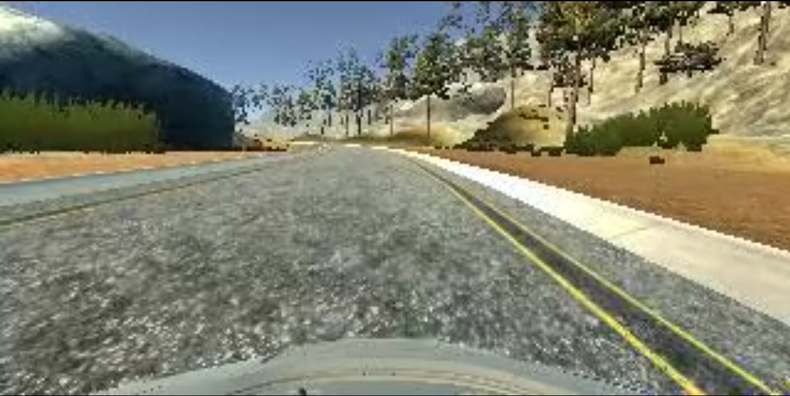
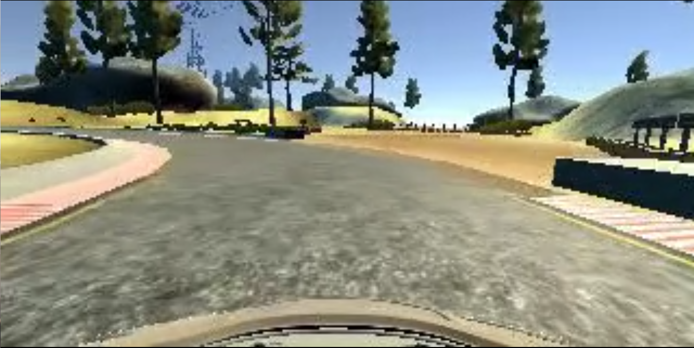
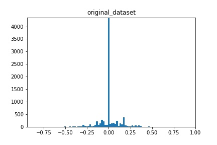
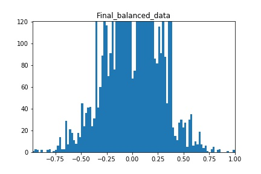
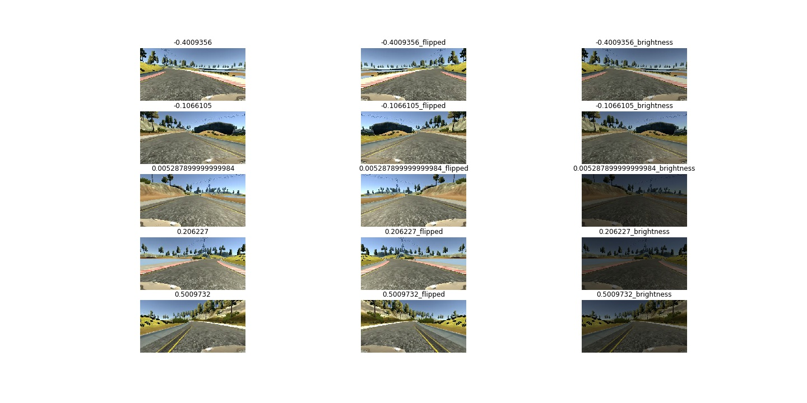

# **Behavioral Cloning Project**
---
The goals / steps of this project are the following:
* Use the simulator to collect data of good driving behavior
* Build, a convolution neural network in Keras that predicts steering angles from images
* Train and validate the model with a training and validation set
* Test that the model successfully drives around track one without leaving the road
* Summarize the results with a written report


[//]: # (Image References)

[image1]: ./examples/placeholder.png "Model Visualization"
[image2]: ./examples/placeholder.png "Grayscaling"
[image3]: ./examples/placeholder_small.png "Recovery Image"
[image4]: ./examples/placeholder_small.png "Recovery Image"
[image5]: ./examples/placeholder_small.png "Recovery Image"
[image6]: ./examples/placeholder_small.png "Normal Image"
[image7]: ./examples/placeholder_small.png "Flipped Image"

### 0. Rubric Points
Here I will consider the [rubric points](https://review.udacity.com/#!/rubrics/432/view) individually and describe how I addressed each point in my implementation.  

### 1. Files Submitted & Code Quality

#### 1.1. Submission includes all required files and can be used to run the simulator in autonomous mode

My project includes the following files:
* **model.py** Contains the script to create and train the model.
* **cnn_models.py** Contains the models used for training in this project.
* **drive.py** Script for driving the car in autonomous mode. (This file was provided by Udacity)
* **model.h5** Contains a trained convolution neural network. (This model works for the first track) 
* **writeup.md** Report summarizing the results (this file)

Extra file:
* **Visualizations.ipynb** Notebook that contains the visualizations I used to create this report, and the process of balancing the dataset.

#### 1.2. Submission includes functional code
Using the Udacity provided simulator and my drive.py file, the car can be driven autonomously around the first track by executing 
```sh
python drive.py model.h5
```

#### 1.3. Submission code is usable and readable

The model.py file contains the code for training and saving the convolution neural network. The file shows the pipeline I used for training and validating the model, and it contains comments to explain how the code works.

### 2. Model Architecture and Training Strategy

#### 2.1. An appropriate model architecture has been employed

For my final model, I use the [nVidia Autonomous vehicle Model](https://arxiv.org/pdf/1604.07316v1.pdf) (cnn_models.py line 32). In section "3.2. Final Model Architecture" it can be observed a more detailed description of this CNN. My implementation includes RELU layers to introduce nonlinearity, a Keras lambda layer for normalization of the data and a Keras Cropping2d layer (cnn_models.py lines 8-9).

#### 2.2. Attempts to reduce overfitting in the model

I did not to modify the model by applying regularization techniques like Dropout or Max pooling. Instead, I concentrated on the following approaches:
* I used only one training epoch.
* I used augmentation data methods: I used counter clockwise and clockwise driving data,  I changed the brightness of some of the images (model.py line 10), and flipped the images (model.py lines 38-40).
* My model was trained and validated on different data sets to ensure that the model was not overfitting (model.py line 64). The model was tested by running it through the simulator and ensuring that the vehicle could stay on the track.

#### 2.3. Model parameter tuning

The model used an adam optimizer, so the learning rate was not tuned manually (model.py line 73).

#### 2.4. Appropriate training data

The training and validation datasets were selected from a balanced subset of the Udacity dataset. I used a combination of the three cameras: center, left and right, using a correction factor for the steering angles of 0.2 (0.2 for the left, -0.2 for the right). The original dataset was balanced with the goal of improving the efficiency of the classifier in the first track. The steps of this data balancing can be observed in the section "3.3. Creation of the Training Set & Training Process" and in the Notebook [balance_and_visualization.ipynb](https://github.com/JKWalleiee/CarND-Behavioral-Cloning-P3/blob/master/balance_and_visualization.ipynb).

In this balanced dataset, I duplicate the data through the flipping of all the images, and I augment the images of the classes lacking data, that is, classes where: abs(angle)>0.5 (0.5~12.5 in the simulator), by changing the brightness of the original and flipped image. (model.py lines 38-52)

### 3. Model Architecture and Training Strategy

#### 3.1. Solution Design Approach

I used 3 types of networks: a linear regression model (cnn_models.py line 12), a [lenet model](http://yann.lecun.com/exdb/lenet/) (cnn_models.py line 19), and, my final model, a nVidia autonomous vehicle model (cnn_models.py line 32). I took an iterative approach for the tests with this networks. For this three models, I used the Udacity sample driving data.

Once I verified that my scripts were working correctly, I added a preprocessing layer and a clipping layer to the beginning of my models (section "3.2. Final Model Architecture"). After this, I started my second iteration, training the lenet model with the complete Udacity sample dataset. When I used this model on the first track of the simulator, the car navigates very close to the curves, and on a section of the road where the edge is not marked, it went off the road.




In my third iteration, I trained the nvidia model, using the complete Udacity sample dataset. With this model, the car navigated very well on the straights sections, staying in the center, however it had problems in the corners and ended up leaving the road in the same section as the lenet model.

From the results of my third iteration and the distribution of the dataset (section "3.3. Creation of the Training Set & Training Process"), I decided to make a balancing of the data, to avoid the model from specializing in the straight sections (steering angle of zero), where there are peaks in the complete dataset. In addition, I added flipped images to prevent biases towards a road direction, and increased the number of images in classes lacking data (abs (angle)> 0.5, 0.5 ~ 12.5 in the simulator). Using these modifications to the training data, I trained the nvidia model and tested in the simulator. With this model, the car is able to drive autonomously around the first track without leaving the road, presenting some vibrations in the straight sections. This leads me to think that the CNN sacrifices a bit of stability in the straight sections of the road, in exchange for greater efficiency in the curves.



This model was tested in two of the simulator modes: "Fastest" and "Fantastic" (which I think are the "easy" and "harder" modes for the model, respectively). The test video of this last model can be found in this [repository](https://github.com/JKWalleiee/CarND-Behavioral-Cloning-P3/blob/master/video.mp4) (or with this Project Submission).

#### 3.2. Final Model Architecture

The final model architecture is shown in the following table:

| Layer         		|     Description	        					| 
|:---------------------:|:---------------------------------------------:| 
| Input         		| 160x320x3 RGB image   							| 
| Lambda         		| Normalization layer, outputs 160x320x3		| 
| Cropping2D     	| cropping layer, outputs 90x320x3 	|
| Convolution2D 5x5     	| kernel: (5,5), strides: (2,2), filters: (24)	|
| RELU					|												|
| Convolution2D 5x5     	| kernel: (5,5), strides: (2,2), filters: (36)	|
| RELU					|												|
| Convolution2D 5x5     	| kernel: (5,5), strides: (2,2), filters: (48)	|
| RELU					|												|
| Convolution2D 5x5     	| kernel: (3,3), strides: (1,1), filters: (64)	|
| RELU					|												|
| Convolution2D 5x5     	| kernel: (3,3), strides: (1,1), filters: (64)	|
| RELU					|												|
| Fully connected		| input 8448, output 100      									|
| Linear Activation					|												|
| Fully connected		| input 100, output 50      									|
| Linear Activation					|												|
| Fully connected		| input 50, output 10      									|
| Linear Activation					|												|
| Fully connected		| input 10, output 1      									|
| Linear Activation					|												|


#### 3.3. Creation of the Training Set & Training Process

To create the training data, I used the Udacity sample data as a base (8036 samples). Here is bar graph that shows how the original Udacity dataset is distributed through the different steering angles, using bins with 0.01 step.



Here, it can be observed a very high peak for the data with a steering angle of zero (4361 images) in comparison with the rest of the data. From the tests conducted in the CNN training with the original dataset, I noticed that my model achieves better results when its trained with a balanced dataset. This balancing of the data can be found in the file [balance_and_visualization.ipynb] (https://github.com/JKWalleiee/CarND-Behavioral-Cloning-P3/blob/master/balance_and_visualization.ipynb). Below is a summary of the balancing process:

* First, I reduced the amount of data with steering angle of zero to a value comparable with the rest of the classes.
* Second, I used the three images from the filtered dataset (center, left and right), using a correction factor for the steering angles of 0.2 (0.2 for the left, -0.2 for the right). The images of the side cameras were used as recovery samples, that is, images that teach the network what to do to drive the car back to the center of the road, when it is very close to the edges of the road.
* Finally, I calculated the average of the data in the histogram up to this point, and halved the images of the steering angle bins with more data than the calculated average value.

Below is a bar graph that shows the histogram of the final balanced dataset (5738 samples).



I loaded the csv file of this balanced dataset, shuffle the data and divided into a training set (80%) and a validation set (20%). The images of the dataset were read from disk and divided in batches in a generator (model.py lines 18-55), to minimize memory consumption. In addition, in the generator, I added flipped images to prevent biases towards a road direction, and increased the number of images in classes lacking data (abs (angle)> 0.5, 0.5 ~ 12.5 in the simulator). Bellow it can be observed some of the samples of the three "types" of images in the training dataset (original, flipped and augmented (change brightness) )



It is important to remember that the change in brightness only applies to images where abs(angle)> 0.5. In the previous figure this image type is shown for other ranges for visualization purposes.

My model has two preprocessing layers, one for normalization and another for cropping the image. the CNN performs this process of cropping of the image to receive only the important areas of the image. Below is an example of the result of this cropping process.


The training and validation generators were fed into the training of the network through the fit_generator method (model.py line 85). For the training I used only one epoch, and an Adam optimizer so that manually training the learning rate was not necessary. My model stops training when the "val_loss" quantity has stopped improving (model.py lines 78-81), and in the end the best model is saved in the [model.h5](https://github.com/JKWalleiee/CarND-Behavioral-Cloning-P3/blob/master/model.h5) file.

1081s - loss: 0.0075 - acc: 7.5927e-04 - val_loss: 0.0250 - val_acc: 0.0000e+00

The video ["video.mp4"](https://github.com/JKWalleiee/CarND-Behavioral-Cloning-P3/blob/master/video.mp4) shows the final result of my model in the first track of the simulator.

### OPTIONAL - Second track.

For track 2, I first loaded my model up to this point and tested it in simulation. My model allowed the car to safely navigate on runway 2 until it founded sharp turns, where the car leaved the road. Then, I decided to collect data from the second track in the training mode of the simulator. Using these new data, I balanced them, loaded the model I had up to this point and retrained with the new dataset. I decided to retrain the network with the new data separately due to two reasons:

* Initially, my goal was use the Udacity dataset for the first track. When I realized that my model did not work for the second track, I had already completed the mandatory points of the project and, therefore, I decided not to modify my training process.

* I wanted to take the opportunity to test what would happen to the model on the first track, if I used tranfer learning techniques focused on the second track.

I did several tests, retrained the whole network, I freezed the convolutions layers weights, reduced the learning rate, and got a model that works satisfactorily on the [second track](). However, when testing this model on the first track, the car remained unstable and very close to the curves. This may be due to one or more of the following reasons:

* My driving behavior. In some areas of the second track, I decided to mantain the car on the road controlling the speed instead of navigating on the center of the road. This may have damaged the behavior learned from the Udacity data.

* I performed a separate training for the data from the second track. In this case, the model, optimized for the first track, updates its weights using information only from the second track. In a real implementation it would be more optimal to use the data from both tracks in the same training.

* I collected data from the full second track. Instead , a good idea could be to collect images of problematic areas for my trained model.

The task of using tranfer learning from a model (trained for the first track), to the data of the second track, with the goal that the final model performs correctly in both tracks, presents several complications. This process implies a correct tunning of the parameters, and doing several tests: freeze the convolutional layers weights, modify (minimize) the learning rate, etc. This complicates the training unnecessarily.


