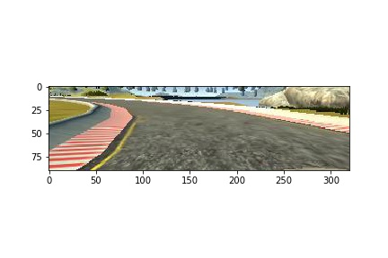

1081s - loss: 0.0075 - acc: 7.5927e-04 - val_loss: 0.0250 - val_acc: 0.0000e+00
# **Behavioral Cloning Project**
---
The goals / steps of this project are the following:
* Use the simulator to collect data of good driving behavior
* Build, a convolution neural network in Keras that predicts steering angles from images
* Train and validate the model with a training and validation set
* Test that the model successfully drives around track one without leaving the road
* Summarize the results with a written report


[//]: # (Image References)

[image1]: ./examples/placeholder.png "Model Visualization"
[image2]: ./examples/placeholder.png "Grayscaling"
[image3]: ./examples/placeholder_small.png "Recovery Image"
[image4]: ./examples/placeholder_small.png "Recovery Image"
[image5]: ./examples/placeholder_small.png "Recovery Image"
[image6]: ./examples/placeholder_small.png "Normal Image"
[image7]: ./examples/placeholder_small.png "Flipped Image"

### 0. Rubric Points
Here I will consider the [rubric points](https://review.udacity.com/#!/rubrics/432/view) individually and describe how I addressed each point in my implementation.  

### 1. Files Submitted & Code Quality

#### 1.1. Submission includes all required files and can be used to run the simulator in autonomous mode

My project includes the following files:
* **model.py** Contains the script to create and train the model.
* **cnn_models.py** Contains the models used for training in this project.
* **drive.py** Script for driving the car in autonomous mode. (This file was provided by Udacity)
* **model.h5** Contains a trained convolution neural network. (This model works for the first track) 
* **writeup.md** Report summarizing the results (this file)

Extra file:
* **Visualizations.ipynb** Notebook that contains the visualizations I used to create this report, and the process of balancing the dataset.

#### 1.2. Submission includes functional code
Using the Udacity provided simulator and my drive.py file, the car can be driven autonomously around the first track by executing 
```sh
python drive.py model.h5
```

#### 1.3. Submission code is usable and readable

The model.py file contains the code for training and saving the convolution neural network. The file shows the pipeline I used for training and validating the model, and it contains comments to explain how the code works.

### 2. Model Architecture and Training Strategy

#### 2.1. An appropriate model architecture has been employed

For my final model, I use the [nVidia Autonomous vehicle Model](https://arxiv.org/pdf/1604.07316v1.pdf) (cnn_models.py line 32). In section "3.2. Final Model Architecture" it can be observed a more detailed description of this CNN. My implementation includes RELU layers to introduce nonlinearity, a Keras lambda layer for normalization of the data and a Keras Cropping2d layer (cnn_models.py lines 8-9).

#### 2.2. Attempts to reduce overfitting in the model

I did not to modify the model by applying regularization techniques like Dropout or Max pooling. Instead, I concentrated on the following approaches:
* I used only one training epoch.
* I used augmentation data methods: I used counter clockwise and clockwise driving data,  I changed the brightness of some of the images (model.py line 10), and flipped the images (model.py lines 38-40).
* My model was trained and validated on different data sets to ensure that the model was not overfitting (model.py line 64). The model was tested by running it through the simulator and ensuring that the vehicle could stay on the track.

#### 2.3. Model parameter tuning

The model used an adam optimizer, so the learning rate was not tuned manually (model.py line 73).

#### 2.4. Appropriate training data

The training and validation datasets were selected from a balanced subset of the Udacity dataset. I used a combination of the three cameras: center, left and right, using a correction factor for the steering angles of 0.2 (0.2 for the left, -0.2 for the right). The original dataset was balanced with the goal of improving the efficiency of the classifier in the first track. The steps of this data balancing can be observed in the section "3.3. Creation of the Training Set & Training Process" and in the Notebook [balance_and_visualization.ipynb](https://github.com/JKWalleiee/CarND-Behavioral-Cloning-P3/blob/master/balance_and_visualization.ipynb).

In this balanced dataset, I duplicate the data through the flipping of all the images, and I augment the images of the classes lacking data, that is, classes where: abs(angle)>0.5 (0.5~12.5 in the simulator), by changing the brightness of the original and flipped image. (model.py lines 38-52)

### 3. Model Architecture and Training Strategy

#### 3.1. Solution Design Approach

I used 3 types of networks: a linear regression model, a lenet model, and, my final model, a nVidia autonomous vehicle model. I took an iterative approach for the tests with this networks. For this three models, I used the Udacity sample driving data.

Once I verified that my scripts were working correctly, I added a preprocessing layer and a clipping layer to the beginning of my models (x). After this, I started my second iteration, using the lenet model. When I trained this model and used it on the first track of the simulator, the car navigates very close to the curves (fig. 3.1), and on a section of the road where the edge is not marked (fig. 3.2), it went off the road.





In order to gauge how well the model was working, I split my image and steering angle data into a training and validation set. I found that my first model had a low mean squared error on the training set but a high mean squared error on the validation set. This implied that the model was overfitting. 

To combat the overfitting, I modified the model so that ...

Then I ... 

The final step was to run the simulator to see how well the car was driving around track one. There were a few spots where the vehicle fell off the track... to improve the driving behavior in these cases, I ....

At the end of the process, the vehicle is able to drive autonomously around the track without leaving the road.

#### 3.2. Final Model Architecture

The final model architecture (model.py lines 18-24) consisted of a convolution neural network with the following layers and layer sizes ...

Here is a visualization of the architecture (note: visualizing the architecture is optional according to the project rubric)

![alt text][image1]

#### 3.3. Creation of the Training Set & Training Process

To capture good driving behavior, I first recorded two laps on track one using center lane driving. Here is an example image of center lane driving:

![alt text][image2]

I then recorded the vehicle recovering from the left side and right sides of the road back to center so that the vehicle would learn to .... These images show what a recovery looks like starting from ... :

![alt text][image3]
![alt text][image4]
![alt text][image5]

Then I repeated this process on track two in order to get more data points.

To augment the data sat, I also flipped images and angles thinking that this would ... For example, here is an image that has then been flipped:

![alt text][image6]
![alt text][image7]

Etc ....

After the collection process, I had X number of data points. I then preprocessed this data by ...


I finally randomly shuffled the data set and put Y% of the data into a validation set. 

I used this training data for training the model. The validation set helped determine if the model was over or under fitting. The ideal number of epochs was Z as evidenced by ... I used an adam optimizer so that manually training the learning rate wasn't necessary.
